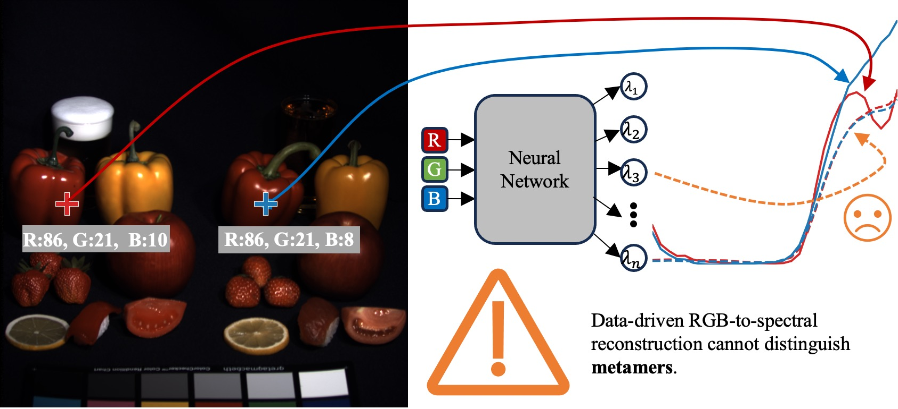

# Limitations of Data-Driven Spectral Reconstruction: An Optics-Aware Analysis

[Qiang Fu<sup>1,*</sup>](https://fuqiangx.github.io/), [Matheus Souza<sup>1,*</sup>](https://matheusvms.github.io/), [Eunsue Choi<sup>2</sup>](https://eschoi.com/), [Suhyun Shin<sup>2</sup>](https://shshin1210.github.io/suhyun_website/), [Seung-Hwan Baek<sup>2</sup>](https://sites.google.com/view/shbaek/), and [Wolfgang Heidrich<sup>1</sup>](https://vccimaging.org/People/heidriw/)

<sup>1</sup>KAUST, <sup>2</sup>POSTECH

*Joint first authors.

> Abstract
>
> Hyperspectral imaging empowers machine vision systems with the distinct capability of identifying materials through recording their spectral signatures. Recent efforts in data-driven spectral reconstruction aim at extracting spectral information from RGB images captured by cost-effective RGB cameras, instead of dedicated hardware. Published work reports exceedingly high numerical scores for this reconstruction task, yet real-world performance lags substantially behind.
>
> In this paper we **systematically analyze** the performance of such methods with three groups of dedicated experiments. First, we evaluate the practical overfitting limitations with respect to current datasets by training the networks with less data, validating the trained models with unseen yet slightly modified data, and cross-dataset validation. Second, we reveal **fundamental limitations** in the ability of RGB to spectral methods to deal with metameric or near-metameric conditions, which have so far gone largely unnoticed due to the insufficiencies of existing datasets. We achieve this by validating the trained models with metamer data generated by metameric black theory and re-training the networks with various forms of metamers. This methodology can also be used for data augmentation as a partial mitigation of the dataset issues, **although the RGB to spectral inverse problem remains fundamentally ill-posed**.
> 
> Finally, we analyze the potential for modifying the problem setting to achieve better performance by exploiting some form of optical encoding provided by either incidental optical aberrations or some form of deliberate optical design. Our experiments show that such approaches do indeed provide improved results under certain circumstances, however their overall performance is limited by the same dataset issues as in the plain RGB to spectral scenario. We therefore conclude that **future progress on snapshot spectral imaging will heavily depend on the generation of improved datasets which can then be used to design effective optical encoding strategies**.

|  |
|:--:|
| *Figure 1. Data-driven spectral reconstruction from RGB images is fundamentally limited in the presence of metamers.* |


In this repository, we provide the source code used for carrying out the analysis experiments we have done in the paper. Please follow the instructions below to reproduce the results shown in the paper.

## 0. Environment setup

We tested our code with `python=3.12` and `PyTorch 2.5.0 + CUDA 12.4` on `Ubuntu 20.04`.

Step 1: set up environment

```bash
conda env create -f environment.yml
conda activate HSI
```

Step 2: Install PyTorch manually for your CUDA or CPU setup (see [official instructions](https://pytorch.org/get-started/previous-versions/)), e.g.:

```bash
conda install pytorch==2.5.0 torchvision==0.20.0 torchaudio==2.5.0 pytorch-cuda=12.4 -c pytorch -c nvidia
```

Step 3: install necessary libraries by

```bash
pip install -r requirements.txt
```

For GMSR (using `mamba_ssm`), it requires a strict environment. We tested it with `python=3.10.13` and `PyTorch 2.1.1 + CUDA 11.8` on `Ubuntu 20.04`.

Step 1: set up the environment

```bash
conda env create -f environment_mamba.yml
conda activate HSI-mamba
```

Step 2: install PyTorch manually

```bash
pip install torch==2.1.1+cu121 torchvision==0.16.1+cu121 torchaudio==2.1.1+cu121 --index-url https://download.pytorch.org/whl/cu121
pip install -r requirements_mamba.txt
```

Ignore any warnings or errors after this step.

Step 3: install other libraries

```bash
pip install -r requirements_mamba.txt
```

## 1. Dataset preparation

In order to ensure a unified analysis pipeline, we convert all the involved datasets into the Matlab `.mat` format that is used in the `ARAD_1K` dataset as a baseline.

### 1.1 CAVE

The original `CAVE` data are stored in 16-bit `.png` files. The `dataset_tools/prepare_CAVE.py` script can be used to do the data conversion by running

```bash
python ./dataset_tools/prepare_CAVE.py --dataset_root 'path/to/raw/CAVE' --dest_root './datasets/CAVE/' 
```

where `path/to/raw/CAVE` is the original CAVE data path.

The resulting hyperspectral datacube has the shape [31, 512, 512]. Data range is [0.0, 1.0].

To ensure reproducibility, please use the provided train/valid lists.

### 1.2 ICVL

The original `ICVL` data are stored in Matlab `.mat` files. The `dataset_tools/prepare_ICVL.py` script can be used to do the data conversion by running

```bash
python ./dataset_tools/prepare_CAVE.py --dataset_root 'path/to/raw/ICVL' --dest_root './datasets/ICVL/' 
```

where `path/to/raw/ICVL` is the original ICVL data path.

The resulting hyperspectral datacube has the shape [31, 1392, 1040]. Data range is [0.0, 1.0].

To ensure reproducibility, please use the provided train/valid lists.

### 1.3 KAUST

#### [Update on Jan-20, 2026] 

The raw data (Matlab mat files) of the KAUST dataset have been updated. Please check out [http://hdl.handle.net/10754/670368](http://hdl.handle.net/10754/670368).

The original `KAUST` data are stored in Matlab `.mat` files. The `dataset_tools/prepare_KAUST.py` script can be used to do the data conversion by running

```bash
python ./dataset_tools/prepare_KAUST.py --dataset_root 'path/to/raw/KAUST' --dest_root './datasets/KAUST/' 
```

where `path/to/raw/KAUST` is the original KAUST data path.

The resulting hyperspectral datacube has the shape [31, 512, 482]. Data range is [0.0, 1.0].

To ensure reproducibility, please use the provided train/valid lists.

## 2. Metameric data generation

We adopt the metameric black theory to generate metamer data (see Section III-C). The Python script `metamer/generate_metamers.py` can be used to generate metamers for different settings. For the demonstrated experiments in the paper, we mainly test the following 4 situations.

(1) Noise-free, aberration-free

Run the following command to generate metamers for the `ARAD_1K` dataset with a metameric black coefficient of `alpha = 0.0`. No noise is applied (`npe = 0`). No optical aberrations are applied (`psf_name = None`). Output RGB images are saved as lossless `.png` files.

```bash
python ./metamer/generate_metamers.py --psf_name None --dataset_name ARAD_1K --npe 0 --alpha 0.0 --rgb_format png
```

(2) Noisy, aberration-free

Run the following command to generate metamers for the `ARAD_1K` dataset with a metameric black coefficient of `alpha = 0.0` and Poisson noise (`npe = 1000`). No optical aberrations are applied (`psf_name = None`). Output RGB images are saved as lossless `.png` files.

```bash
python ./metamer/generate_metamers.py --psf_name None --dataset_name ARAD_1K --npe 1000 --alpha 0.0 --rgb_format png
```

(3) Noisy, aberrated

Run the following command to generate metamers for the `ARAD_1K` dataset with a metameric black coefficient of `alpha = 0.0`, Poisson noise (`npe = 1000`), and optical aberrations modeled by `psf_name = double_gauss_50mm_F1.8`. Output RGB images are saved as lossless `.png` files.

```bash
python ./metamer/generate_metamers.py --psf_name double_gauss_50mm_F1.8 --dataset_name ARAD_1K --npe 1000 --alpha 0.0 --rgb_format png
```

(4) Noise-free, aberrated

Run the following command to generate metamers for the `ARAD_1K` dataset with a metameric black coefficient of `alpha = 0.0`. No noise is applied (`npe = 0`). Optical aberrations modeled by `psf_name = double_gauss_50mm_F1.8` are applied. Output RGB images are saved as lossless `.png` files.

```bash
python ./metamer/generate_metamers.py --psf_name double_gauss_50mm_F1.8 --dataset_path ./datasets --dataset_name ARAD_1K --npe 0 --alpha 0.0 --rgb_format png
```

Note that, by altering the nuisance parameters and metameric black coefficient, it is possible to directly model the metamerism phenomenon: **the same color from different spectra** under various imaging conditions.

## 3. Finding 1: Atypical overfitting

All the experiments in this paper are conducted on an NVIDIA A100 GPU (80~GB memory).

### 3.1 Training with less data

Run the following script to train the MST++ model with `50%` of training data on the `ARAD_1K` dataset.

```bash
python ./MST_plus_plus_code/train_code/train.py --method mst_plus_plus --percent 50
```

The `train_vanilla_percent.sh` script can be used for other experiments with different combinations. These experimental results are shown in Table II, Section IV-A in the paper.

### 3.2 Validation with unseen data

We generate unseen data from the original `ARAD_1K` dataset with slighly altered nuisance parameters to validate the pretrained models. These experimental results are shown in Table III, Section IV-B in the paper and Table S.I and Table S.II in the Supplementary Material. Example scripts are shown below for Table III.

(1) Noise-less, aberration-free, JPG compression (Row 2, Tabel III)

Run the following script to validate the pretrained MST++ model on `ARAD_1K` with no noise and a different JPG compression ratio (Q = 65).

```bash
python ./RGB2HS/validate_RGB2HS.py --psf_name None --dataset_name ARAD_1K --method mst_plus_plus --pretrained_root ./RGB2HS/model_zoo/mst_plus_plus.pth --result_root ./RGB2HS/validate_exp --npe 0 --rgb_format jpg
```

(2) Noise-less, aberration-free, lossless PNG (Row 3, Tabel III)

Run the following script to validate the pretrained MST++ model on `ARAD_1K` with no noise in the lossless PNG format.

```bash
python ./RGB2HS/validate_RGB2HS.py --psf_name None --dataset_name ARAD_1K --method mst_plus_plus --pretrained_root ./RGB2HS/model_zoo/mst_plus_plus.pth --result_root ./RGB2HS/validate_exp --npe 0 --rgb_format png
```

(3) Noisy, aberrated, lossless PNG (Row 4, Tabel III)

Run the following script to validate the pretrained MST++ model on `ARAD_1K` with a different noise level (`npe = 1000`) and optical aberrations (introduced by a double Gauss lens) in the lossless PNG format.

```bash
python ./RGB2HS/validate_RGB2HS.py --psf_name double_gauss_50mm_F1.8 --dataset_name ARAD_1K --method mst_plus_plus --pretrained_root ./RGB2HS/model_zoo/mst_plus_plus.pth --result_root ./RGB2HS/validate_exp --npe 1000 --rgb_format png
```

The `validate_RGB2HS.sh` script can be used for other experiments with different combinations.

### 3.3 Cross-dataset validation

We can reuse the `validate_RGB2HS.sh` script to cross-validate pretrained models from one dataset to another. An example script to validate the pretrained MST++ model from `ARAD_1K` on `CAVE` is shown below. These experimental results are shown in Table IV in the paper and Table S.III and Table S.IV in the Supplementary Material.

```bash
python ./RGB2HS/validate_RGB2HS.py --psf_name None --dataset_name CAVE --method mst_plus_plus --pretrained_root ./RGB2HS/model_zoo/mst_plus_plus.pth --result_root ./RGB2HS/validate_exp --npe 0 --rgb_format png
```

Note that the baseline pretrained models on `CAVE`, `ICVL`, and `KAUST` need to be trained before doing the cross-validation.

## 4. Finding 2: Metameric failure

### 4.1 Validation with metamers

We use metamer data (see [2. Metameric data generation](#2-metameric-data-generation) above) to validate the pretrained models. The experimental results are shown in Table V in the paper. An example script is shown below to validate the pretrained MST++ model with metamers from the `ARAD_1K` dataset.

```bash
python ./RGB2HS/validate_RGB2HS.py --psf_name None --dataset_name ARAD_1K --method mst_plus_plus --pretrained_root ./RGB2HS/model_zoo/mst_plus_plus.pth --result_root ./RGB2HS/validate_exp --npe 0 --rgb_format png --metamer True
```

The `validate_RGB2HS.sh` cript can be reused for other experiments with different combinations.

### 4.2 Training with metamers

We train the models with two metamer situations: fixed metamer and on-the-fly metamer, compared with the baseline of no metamer. Fixed metamer means the training set and validation set contain both the original data and the generated metamer data (fixed metameric black coefficient $\alpha = 0$) saved on disk; on-the-fly metamer means the metamer data are generated during the training with random metameric black coefficients, and the validation set contains both the original data and the generated metamer data (fixed metameric black coefficient $\alpha = 0$) saved on disk. The baseline case, no metamer, means the training set and the validation set contain only the original data (equivalent to what has been done in previous works without accounting for metamers entirely).

(1) Training with no metamers

Run the following script for trainig the MST++ model from scratch on the `ARAD_1K` dataset with no noise and no aberrations.

```bash
python ./RGB2HS/train_RGB2HS_no_metamer.py --psf_name None --dataset_path ./datasets --dataset_name ARAD_1K --method mst_plus_plus --result_root ./RGB2HS/train_exp_no_metamer --npe 0 
--init_lr 4e-4
```

The `train_RGB2HS_no_metamer.sh` script can be used for experiments with other models.

(2) Training with fixed meters

Run the following script for trainig the MST++ model from scratch on the `ARAD_1K` dataset with no noise and no aberrations.

```bash
python ./RGB2HS/train_RGB2HS_fixed_metamer.py --psf_name None --dataset_path ./datasets --dataset_name ARAD_1K --method mst_plus_plus --result_root ./RGB2HS/train_exp_fixed_metamer --npe 0 
--init_lr 4e-4
```

The `train_RGB2HS_fixed_metamer.sh` script can be used for experiments with other models.

(3) Training with on-the-fly metamers

Run the following script for trainig the MST++ model from scratch on the `ARAD_1K` dataset with no noise and no aberrations.

```bash
python ./RGB2HS/train_RGB2HS_onthefly_metamer.py --psf_name None --dataset_path ./datasets --dataset_name ARAD_1K --method mst_plus_plus --result_root ./RGB2HS/train_exp_onthefly_metamer --npe 0 
--init_lr 4e-4
```

The `train_RGB2HS_onthefly_metamer.sh` script can be used for experiments with other models.

The above experimental results are shown in Table VI and Table VII in the paper and Table S.V, Table S.VI, and Table S.VII in the Supplementary Material.

## 5. Finding 3: The aberration advantage and effective spectral encoding

Run the following script for trainig the MST++ model from scratch on the `ARAD_1K` dataset with noise (`npe = 1000`) and optical aberrations (introduced by a double Gauss lens).

In the fixed metamer case,

```bash
python ./RGB2HS/train_RGB2HS_fixed_metamer.py --psf_name double_gauss_50mm_F1.8 --dataset_path ./datasets --dataset_name ARAD_1K --method mst_plus_plus --result_root ./RGB2HS/train_exp_fixed_metamer --npe 1000 
--init_lr 4e-4
```

In the on-the-fly metamer case,

```bash
python ./RGB2HS/train_RGB2HS_onthefly_metamer.py --psf_name double_gauss_50mm_F1.8 --dataset_path ./datasets --dataset_name ARAD_1K --method mst_plus_plus --result_root ./RGB2HS/train_exp_onthefly_metamer --npe 1000 
--init_lr 4e-4
```

The `train_RGB2HS_fixed_metamer.sh` and `train_RGB2HS_onthefly_metamer.sh` script can be used for experiments with other models.

We also provide other forms of spectral encoding, e.g., grating, diffraction rotatoin, to evaluate their effects on the reconstruction performance. Such PSFs can be found in the `PSFs` folder.

## 6. Conclusion

In this work, we have comprehensively analyzed a category of data-driven spectral reconstruction methods from RGB images by reviewing the problem fundamentally from dataset bias to physical image formation, and to reconstruction networks. From an optics-aware perspective, we leverage both metamerism and optical aberrations to reassess existing methodologies.

The major findings of our study reveal important yet previously overlooked limitations in this research direction. (1) The limitations of current datasets lead to overfitting to both nuisance parameters (noise, compression), as well as limited scene content. (2) Metamerism in particular presents a challenge both in terms of under-representation in the datasets, and in terms of fundamental limitations of spectral reconstruction from RGB input. (3) Metameric augmentation along with the targeted use of optical aberrations paves the way to combating the metamer issue, though more effective spectral encodings are demanded to solve the challenge.

Our results systematically demonstrate that it is impossible to accurately reconstruct spectra solely from RGB images. In order to realize the dream of spectral estimation from arbitrary RGB sources, it is necessary to coherently and jointly diversify the spectral contents in hyperspectral image datasets, adopt side-channel information from the optical system, and embrace versatile spectral data augmentation methods to fully enable the power of networks in adaptation to whole families of spectral encodings. We argue that addressing these foundational issues is imperative. Continuing to propose new network designs without rethinking the misdefined problem formulation will fall into the same fundamental shortcomings. Clarifying these limitations will enable the community to focus on solving the real challenges in snapshot spectral imaging.

The dataset limitations we point out in this work may also apply to other spectral reconstruction problems using the referenced datasets, such as CASSI, PSF engineering, and multispectral-hyperspectral fusion. In particular, the same metamerism issue has not yet been extensively evaluated in such domains either. Our findings underscore the broader importance of effective spectral encodings in such snapshot spectral imaging problems. The proposed metameric augmentation technique could inform future directions in optical design, network design, and, more importantly, their joint optimization to cope with metamers.

## Citations

TODO

## License
Our code is licensed under MIT License. By downloading the software, you agree to the terms of this License. 

## Questions
Should you have any questions, please feel free to contact Qiang Fu at qiang[dot]fu[at]kaust[dot]edu[dot]sa.
